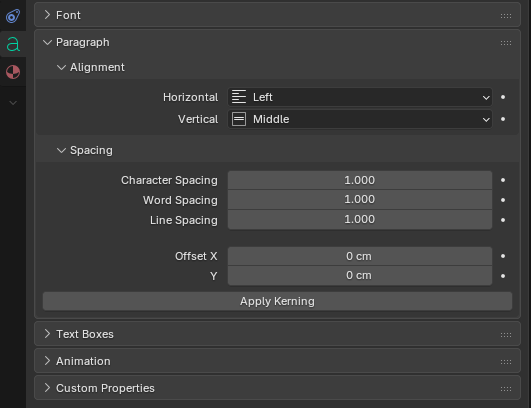

# Auto Kerning for Blender

## About
Apply "auto kerning" to text objects in blender.

For a selected text object, this add-on sets the kerning for each character pair
in the text body's content using the kerning information stored in the font.

## Use
When a font object is selected, the "Apply Kerning" button appears under Paragraph > Spacing
in the Data tab of the Properties Editor.

## Limitations
- Supports left-to-right fonts in TTF or OTF format
- If the text value is changed, auto-kerning needs to be re-applied

## Acknowledgments
This add-on uses:
- https://github.com/adobe-type-tools/kern-dump
- https://github.com/fonttools/fonttools